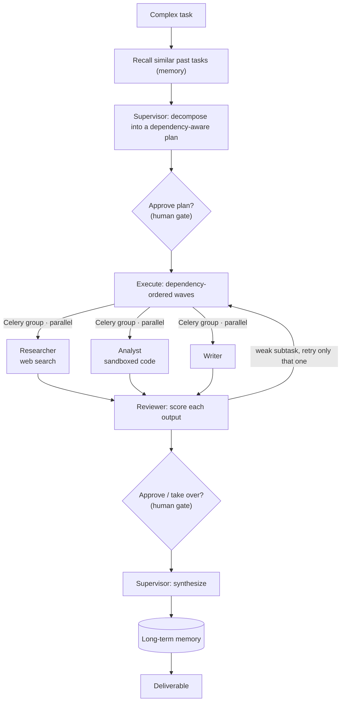
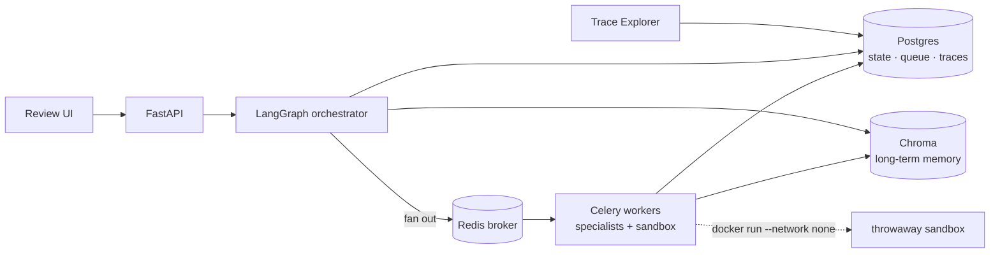

# Foreman


**Production infrastructure for autonomous AI workflows.** A supervisor agent
decomposes a complex task into a dependency-aware plan, delegates the subtasks to
specialist tool-using agents that run **in parallel across distributed workers**, a
reviewer validates each result, the system escalates to a human when confidence is low
or an action is sensitive, learns from every task via long-term memory, and records
every decision as a real OpenTelemetry trace.

It is not a single-agent demo. It is the kind of multi-agent system companies are
actually building: explicit control flow, real tool use, durable human-in-the-loop, and
full observability, with honest engineering trade-offs called out rather than hidden.



## How it works

1. **Plan.** The supervisor turns a request into an ordered, dependency-aware plan
   (structured output, validated to be acyclic and to reference only wired specialists).
   It recalls similar past tasks from memory first, so planning improves over time.
2. **Execute, distributed.** Subtasks fan out to **Celery workers** over Redis in
   **dependency-ordered waves**: each wave runs in parallel, joins back into shared graph
   state, and feeds its outputs to the next wave's dependents. Specialists are a
   **researcher** (web search), an **analyst** (writes and runs Python in a throwaway
   sandboxed container), and a **writer**.
3. **Review.** A reviewer scores every output; only the subtasks that fail are retried
   (bounded), each with the reviewer's feedback, never the whole batch.
4. **Human-in-the-loop.** The run escalates on low plan-confidence, a sensitive action,
   exhausted retries, or an explicit request. It **pauses durably** (state checkpointed)
   and resumes on the operator's decision: approve, reject with feedback, modify the plan,
   or take over the output.
5. **Remember.** Each finished task is distilled into a long-term vector memory (Chroma)
   that future, similar tasks recall during planning.
6. **Observe.** Every run is a real **OpenTelemetry** trace (node, tool, and LLM spans
   nested across worker processes) with per-run cost and token accounting, a trace
   explorer, and counterfactual replay for debugging.

## Architecture

LangGraph owns the control flow (the state machine, the retry loop, the durable
pause/resume) and *fans out* to Celery for parallel execution. The graph is never itself
a task, so tracing and pause/resume stay intact. Durable state lives on Postgres in the
distributed deployment (or embedded SQLite locally), behind a factory so the calling code
never picks a backend.



| Concern | Choice | Why |
| --- | --- | --- |
| Orchestration | LangGraph | Explicit nodes/edges/state, a capped retry loop, a durable interrupt: control flow you can see, not hide |
| LLM providers | OpenAI + Anthropic behind one interface | Model routing and deprecation insurance become config |
| Specialist execution | Celery + Redis | Genuine parallelism across worker processes; the graph fans out and gathers |
| Durable state | Postgres / SQLite via a factory | Embedded for local/dev, shared for distributed, via one config flag and no code change |
| Long-term memory | ChromaDB (embedded or server) | Semantic recall of past tasks; bring-your-own embeddings |
| Code execution | Docker, throwaway container | `--network none` plus CPU/memory/time limits; never runs on the host |
| Observability | OpenTelemetry to SQLite/Postgres | Standard `gen_ai.*` spans, cross-worker context propagation, no collector to run |
| API / UIs | FastAPI + Streamlit | An HTTP surface over the runner; operator review and trace exploration |

## Engineering highlights

The parts that took real design, not just wiring:

- **Dependency-ordered execution across stateless workers.** Subtasks dispatch in
  topological *waves*. Each wave is a parallel Celery group; the orchestrator runs the whole
  wave, joins the results into graph state, then hands each dependent subtask its inputs. So
  workers never read each other's state directly. The one thing that would force a shared
  Redis store, a subtask reading a peer's output *while both are still running*, never happens
  by design, so that store isn't built.
- **One trace across process boundaries.** A run spans the orchestrator and several worker
  processes, yet reconstructs as a single tree: the W3C `traceparent` is injected at
  dispatch and re-activated in the worker, whose spans nest under the originating run.
- **Durable human-in-the-loop.** A run pauses on escalation, checkpoints its state, and
  resumes (in a *different process*) when the operator decides, via a real LangGraph
  interrupt rather than a polling flag.
- **Backend-swappable storage behind an enforced seam.** The checkpointer, approval queue,
  and trace store run on SQLite or Postgres by one config flag. The seam writes SQL once
  and rewrites `?` to `%s` for Postgres, guarded by a validator that *fails loud* on
  anything the rewrite can't safely translate, rather than documenting the hazard and
  hoping.

## Screenshots

_Coming soon: the operator review queue (a paused run awaiting approval) and the
trace-explorer span tree (nested cross-worker spans with per-node cost), plus a short
walkthrough video._

## A real run

Submitting *"recommend a python web framework"* to the running stack produced this
(trimmed, **actual** synthesised output; supervisor plan → researcher + analyst + writer on
workers → reviewer → synthesis):

> ## Growth Analysis: FastAPI Is the Clear Leader
> The growth data points unambiguously in one direction: **FastAPI is the fastest-growing
> Python web framework by a substantial margin.** According to the 2024 Python Developers
> Survey, FastAPI's adoption rose from **29% in 2023 to 38% in 2024**, a **+31% relative
> increase in a single year** and the largest single-year gain recorded for any Python web
> framework …
>
> ## Recommendation
> **For teams building APIs, microservices, or AI/ML backends, FastAPI is the framework to
> adopt** … Choose **Django** for full-featured, content-driven applications … Choose
> **Flask** for maximum architectural freedom on small-to-medium apps …

## Run it

### The full stack (one command)

```bash
cp .env.example .env          # add provider keys: OPENAI / ANTHROPIC / TAVILY
docker compose up --build -d  # api, worker, redis, postgres, chroma, three UIs
bash scripts/demo.sh          # submit the showcase task and watch it run
```

- API `http://localhost:8000`: `POST /tasks`, `GET /tasks/{id}`, `GET /approvals`,
  `POST /approvals/{id}`, `DELETE /memory/{id}`
- Console (submit & watch): `http://localhost:8503`
- Review UI: `http://localhost:8501` · Trace explorer: `http://localhost:8502`

### Local development

```bash
python -m venv .venv && source .venv/bin/activate
pip install -e ".[dev]"
pytest                        # fully offline: fakes, eager Celery, SQLite
foreman run --trace "Research the history of the bicycle"
streamlit run foreman/ui/explorer.py   # walk the recorded trace
```

## How it's tested

The suite is **offline-first and deterministic**. Every external dependency (LLM provider,
web search, embedder, sandbox, tracer) sits behind a Protocol or a factory with a fake, and
Celery runs eager, so `pytest` touches no network and no live model. Tests check that the work
actually happened (the researcher produced output, the reviewer scored it), not merely that
nothing threw, since a failed subtask is captured rather than crashing and a broken run can
still look "done."

Beyond the suite, the full stack has been run end to end against live models (OpenAI,
Anthropic, Tavily) via docker-compose; the sample above is real output from one such run. The
real Postgres, Redis, and Docker paths are verified behind opt-in markers.

## Design decisions & trade-offs

- **Dependency data-flow is graph-brokered, not Redis-shared** (see Engineering highlights).
- **"Replay" is three distinct features**, not one: read-only trace stepping, counterfactual
  forking (re-run from a checkpoint with an edited input), and mocked-cassette eval replay.
  They have different determinism guarantees, and this README is honest about which is which.
- **Single trusted operator** is assumed for the API and UIs; production would add auth.
  Memories aren't user-keyed yet, so the delete endpoint purges by id today.

## Requirements

Python 3.11 to 3.13 (ChromaDB's `onnxruntime` has no 3.14 wheel yet; develop on 3.12).
